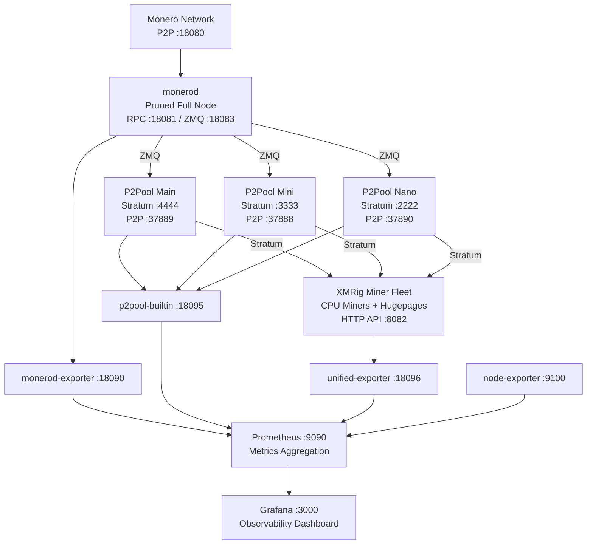

# Monero Farm

XMR mining farm management — **monerod** full node + **P2Pool** decentralized mining (main/mini/nano) + **XMRig** CPU miner fleet, with full **Prometheus + Grafana** observability.

All services managed via **systemd** and provisioned with **Ansible**.

Part of [Project Hydra](https://github.com/scoobydont-666) — Head #2.

## Architecture



## Tech Stack

| Component | Technology | Version |
|-----------|-----------|---------|
| **Full Node** | monerod | v0.18.4.6 |
| **Mining Pool** | P2Pool | v4.14 |
| **Miner** | XMRig | v6.25.0 |
| **Metrics** | Prometheus | — |
| **Visualization** | Grafana | — |
| **Exporters** | node-exporter, monerod-exporter, p2pool-builtin, unified-exporter | — |
| **IaC** | Ansible | 2.16+ |
| **Service Management** | systemd | — |
| **OS** | Ubuntu | 22.04+ / 24.04 |

## Prerequisites

- Ubuntu 22.04+ (tested on 24.04)
- Ansible 2.16+
- A primary Monero wallet address (Ledger hardware wallet recommended)
- SSH access to all target hosts

## Quick Start

```bash
# 1. Clone
git clone https://github.com/scoobydont-666/monero-farm.git
cd monero-farm

# 2. Create inventory from the example
cp ansible/inventory/hosts.yml.example ansible/inventory/hosts.yml
# Edit hosts.yml — set your wallet address, host IPs, SSH user

# 3. Dry run (review before applying)
cd ansible
ansible-playbook -i inventory/hosts.yml site.yml --check --diff --connection=local

# 4. Deploy
ansible-playbook -i inventory/hosts.yml site.yml --connection=local

# 5. Verify
./scripts/health-check.sh
```

### Deploy a Single Role

```bash
# XMRig only
ansible-playbook -i inventory/hosts.yml site.yml --tags xmrig --connection=local

# Monitoring stack only
ansible-playbook -i inventory/hosts.yml site.yml --tags monitoring --connection=local

# P2Pool only
ansible-playbook -i inventory/hosts.yml site.yml --tags p2pool --connection=local
```

## Ansible Roles

| Role | Description |
|------|-------------|
| `base` | System users, hugepages (2.5 GB for RandomX), UFW firewall (LAN-only), NTP |
| `monero` | monerod binary, config, systemd unit, pruned full node setup |
| `p2pool` | P2Pool binary, multiple sidechain instances (main + mini; nano optional) |
| `xmrig` | XMRig binary, config, systemd unit per miner host |
| `monitoring` | 4 Prometheus exporters, Prometheus config + 10 alert rules, Grafana with provisioned dashboard |

Version pins are in `ansible/roles/*/defaults/main.yml`. Update and re-run the playbook to upgrade components.

## Service Ports

| Service | Port | Bind | Purpose |
|---------|------|------|---------|
| monerod P2P | 18080 | public | Peer discovery (required open) |
| monerod RPC | 18081 | loopback | JSON-RPC restricted API |
| monerod ZMQ | 18083 | loopback | Block notifications to P2Pool |
| P2Pool nano stratum | 2222 | LAN | Miners connecting at < 1 KH/s |
| P2Pool mini stratum | 3333 | LAN | Miners connecting at 1–10 KH/s |
| P2Pool main stratum | 4444 | LAN | Miners connecting at > 10 KH/s |
| P2Pool main P2P | 37889 | public | Main sidechain peer discovery |
| P2Pool mini P2P | 37888 | public | Mini sidechain peer discovery |
| P2Pool nano P2P | 37890 | public | Nano sidechain peer discovery |
| XMRig HTTP API | 8082 | loopback | Miner stats (avoids :8080 collision) |
| monerod-exporter | 18090 | loopback | 10 basic monerod gauges |
| p2pool-builtin | 18095 | loopback | Native P2Pool metrics per sidechain |
| unified-exporter | 18096 | loopback | 163 combined monerod + P2Pool metrics |
| node-exporter | 9100 | LAN | System CPU, RAM, disk |
| Prometheus | 9090 | loopback | Metrics aggregation |
| Grafana | 3000 | LAN | Dashboard UI |

## P2Pool Sidechain Selection

| Sidechain | Fleet Hashrate | Stratum Port | P2P Port |
|-----------|---------------|--------------|----------|
| nano | < 1 KH/s | :2222 | :37890 |
| mini | 1 – 10 KH/s | :3333 | :37888 |
| main | > 10 KH/s | :4444 | :37889 |

By default, **main + mini** are deployed. Nano is commented out in `ansible/roles/p2pool/defaults/main.yml` — uncomment to enable it.

## Monitoring Stack

Five Prometheus scrape targets feed the unified Grafana dashboard:

| Exporter | Port | What It Provides |
|----------|------|-----------------|
| monerod-exporter | 18090 | 10 basic monerod gauges |
| unified-exporter | 18096 | 163 combined monerod + P2Pool metrics |
| p2pool-builtin | 18095 | Native P2Pool metrics per sidechain |
| observer-exporter | 8000 | External miner stats from p2pool.observer |
| node-exporter | 9100 | System CPU, RAM, disk, network |

### Alert Rules (10 total)

`MonerodDown`, `MonerodNotSyncing`, `MonerodZeroPeers`, `P2PoolExporterDown`, `P2PoolNoStratumConnections`, `P2PoolLowHashrate`, `P2PoolNoBlocksFoundRecently`, `HighCPULoad`, `LowDiskSpace`, `HighRAMUsage`

## Operational Scripts

```bash
# Full service health audit
./scripts/health-check.sh

# Live hashrate across all miners (refreshes every 10s)
./scripts/hashrate-summary.sh --watch

# Orchestrated restart (respects dependency order)
./scripts/restart-all.sh

# Backup configs, wallet keys, P2Pool state
./scripts/backup.sh /path/to/backup/dir
```

## Current Versions

| Component | Version | Config Location |
|-----------|---------|----------------|
| monerod | v0.18.4.6 | `ansible/roles/monero/defaults/main.yml` |
| P2Pool | v4.14 | `ansible/roles/p2pool/defaults/main.yml` |
| XMRig | v6.25.0 | `ansible/roles/xmrig/defaults/main.yml` |

To upgrade: update the version variable in the relevant `defaults/main.yml` and re-run the playbook.

## Security

- `ansible/inventory/hosts.yml` is **gitignored** — contains your wallet address and host IPs
- Copy `hosts.yml.example` and fill in your values — never commit the real file
- All services run as dedicated system users (`monero`, `p2pool`, `miner`, `exporter`) — not root
- systemd hardening: `ProtectSystem=strict`, `PrivateTmp=true`, `NoNewPrivileges=true`
- All RPC and exporter ports bind to loopback only
- UFW restricts stratum + Grafana to LAN subnet
- Grafana runs HTTPS with a self-signed cert generated on first deploy
- monerod P2P and P2Pool P2P are open (required for peer discovery)

## HiveOS Migration

For miners running HiveOS, `scripts/migrate/` provides an in-place migration tool:

```bash
# Required environment variables
export FULLNODE_IP=<your-fullnode-ip>
export FULLNODE_PUBKEY="ssh-ed25519 AAAA... user@host"

# Run from the fullnode host, targeting the miner
./scripts/migrate/hiveos-to-ubuntu.sh <miner-ip> [ssh-user]
```

Also includes a `user-data` cloud-init file for Ubuntu autoinstall. Edit the placeholders (`YOUR_SSH_PUBLIC_KEY_HERE`, `FULLNODE_IP`, LAN CIDR) before use.

## Development

Roles follow standard Ansible layout. All roles are idempotent — safe to re-run. Test with `--check --diff` before applying to production.

```bash
# Lint
ansible-lint ansible/

# Check single host
ansible-playbook -i inventory/hosts.yml site.yml --check --diff --limit <hostname>
```

## Phase / Milestone Status

| Phase | Description | Status |
|-------|-------------|--------|
| F1 | Single-shot installer script (bootstrapped origin) | Complete (legacy) |
| F2 | Ansible roles: base, monero, p2pool, xmrig | Complete |
| F3 | Monitoring stack: 5 exporters, 10 alert rules, Grafana | Complete |
| F4 | Unified exporter (163 combined metrics) | Complete |
| F5 | Operational scripts: health-check, hashrate-summary, restart-all, backup | Complete |
| F6 | HiveOS migration tooling | Complete |
| F7 (future) | Multi-host inventory (beyond single fullnode) | Planned |
| F8 (future) | Hashrate Hedger integration (dynamic thread tuning) | Planned |

## Related Projects

| Project | Relationship |
|---------|-------------|
| [Hashrate Hedger (Head #5)](https://github.com/scoobydont-666) | Reads fleet metrics, auto-adjusts XMRig config |
| [Project Hydra](https://github.com/scoobydont-666) | Umbrella project |

## License

[MIT](LICENSE)
